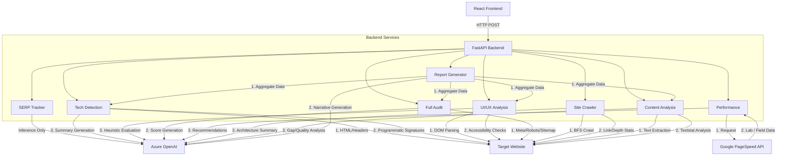

# SEO Audit Tool 

This project provides a comprehensive SEO analysis platform using a React frontend and a FastAPI Python backend. The backend is designed to minimize expensive LLM API calls by utilizing programmatic data extraction (web scraping, free APIs) and only leaning on Azure OpenAI for subjective analysis, summarization, and natural language report generation.

## Project Structure

```text
.
├── frontend/                 # Vite + React UI
│   ├── src/
│   │   ├── seo-audit-tool.jsx # Main dashboard component
│   │   ├── App.jsx            # Entry point
│   │   └── ...
│   └── package.json
└── backend/                  # FastAPI + Python Backend
    ├── main.py               # REST API endpoints
    ├── requirements.txt      # Python dependencies
    ├── .env                  # Azure OpenAI credentials
    └── services/             # 8 distinct analysis services
        ├── ai_client.py      # Azure OpenAI wrapper
        ├── scraper.py        # Shared BeautifulSoup utilities
        ├── serp.py           # SERP Tracker
        ├── tech_detect.py    # Technology Detection
        ├── uiux.py           # UI/UX Analysis
        ├── audit.py          # Full SEO Audit
        ├── performance.py    # Performance Check
        ├── crawler.py        # Site Crawler
        ├── content.py        # Content Analysis
        └── report.py         # Report Generator
```

## System Architecture

The following diagram illustrates the interaction between the frontend, the FastAPI backend routes, and the external services.



---

## Detailed Backend Workflows

Below is an explanation of exactly how each of the 8 service modules functions under the hood. The core philosophy is **"Programmatic First, AI Second"**.

### 1. SERP Rank Tracker (`services/serp.py`)
- **How it works:** This is the only module that relies almost entirely on the LLM's built-in knowledge. 
- **Workflow:**
  1. The backend receives a target URL and a list of keywords.
  2. The service formats a strict prompt requesting the AI to simulate a search for those keywords.
  3. The response includes the estimated position, the page number, competitors ranking higher, and a summarized visibility score.

### 2. Technology Detection (`services/tech_detect.py`)
- **How it works:** This module avoids AI for the actual detection phase by using a robust dictionary of over 30 technology signatures.
- **Workflow:**
  1. **Fetch:** The page HTML and HTTP headers are fetched using the `requests` library.
  2. **Parse:** `BeautifulSoup` parses the Document Object Model (DOM).
  3. **Pattern Matching:** The code scans script `src` attributes, link `href` attributes, meta tags, specific HTML data attributes (like `data-reactroot`), and HTTP headers (`x-powered-by`, `server`) against known framework signatures (e.g., WordPress, React, Next.js, Cloudflare).
  4. **AI Summary:** The raw JSON report is passed to the LLM solely to append a brief SEO impact analysis for the detected stack.

### 3. UI/UX Analysis (`services/uiux.py`)
- **How it works:** A full visual dashboard that extracts accessibility and structural data programmatically, computing precise scores across 6 categories, and feeding the data to the LLM for heuristic evaluation.
- **Workflow:**
  1. **Data Extraction:** Counts images missing alt text, extracts the H1-H6 hierarchy, checks for viewport meta tags, maps input fields against label tags, and detects ARIA roles and Call-to-Action conversion buttons.
  2. **Programmatic Scoring:** The backend computes a weighted overall UX Score (0-100) and individual category scores for Visual Hierarchy, Navigation, Mobile Responsiveness, Accessibility, Content Readability, and Trust & Conversion.
  3. **Interactive Dashboard:** The frontend renders a rich visual interface, including:
     - An animated circular score ring for the overall UX score.
     - A six-axis radar chart visualizing the category breakdown.
     - Individual progress bar score cards for each category.
     - Data summary metrics calculating Links, CTAs, Images, and ARIA roles.
     - Expandable priority issue cards detailing the severity (Critical, Warning, Info) and a recommended fix.
  4. **AI Recommendations:** The LLM analyzes the structured JSON data to provide a concise, actionable summary and expert recommendations.

### 4. Full SEO Audit (`services/audit.py`)
- **How it works:** A comprehensive, heavily visualized audit of technical, on-page, and crawlability factors, combined with AI-driven priority action planning.
- **Workflow:**
  1. **Technical & On-Page Checks:** Measures server response times, HTTPS, canonical tags, hreflang, structured data (JSON-LD), viewport, charset, favicon, and language attributes. It evaluates title and meta description lengths against best practices, and counts Open Graph / Twitter tags.
  2. **Crawlability Verification:** Explicitly attempts to fetch and parse `/robots.txt` and `/sitemap.xml`, checking for sitemap references, disallow directives, URL counts, and lastmod configurations.
  3. **Data Structuring & Scoring:** The backend generates an extensive JSON response containing raw data, a 25+ item pass/fail checklist, prioritized issues, and 5 discrete category scores (Technical SEO, On-Page SEO, Content Quality, Crawlability, Social & Sharing) alongside the combined Overall SEO Score.
  4. **Interactive Dashboard:** The frontend displays:
     - A master animated circular score ring.
     - Horizontal gradient bar charts for the 5 SEO category scores.
     - A comprehensive, grouped pass/fail SEO checklist with accordion dropdowns.
     - A dynamic Google Search Snippet Preview mimicking how the page will appear in SERPs.
     - Expandable, color-coded priority issue cards (Critical, Warning, Info) containing clear instructions on "How to Fix" each problem.
     - Detailed data modules for Heading Structure, Link Analysis (Internal vs External), and Social Tags.
  5. **AI Analysis:** The raw metrics are fed to the LLM to generate an Executive Summary, top priority fixes, quick wins, and competitive edge tips.

### 5. Performance & Lighthouse (`services/performance.py`)
- **How it works:** Completely replaces LLM estimation with real-world metrics from Google's infrastructure.
- **Workflow:**
  1. **API Call:** The backend makes parallel asynchronous HTTP requests to the free Google PageSpeed Insights API for both "mobile" and "desktop" strategies.
  2. **Extraction:** It parses the JSON response to extract Core Web Vitals (LCP, INP, CLS), Lab metrics (FCP, TBT, Speed Index), and specific optimization opportunities (e.g., "Serve images in next-gen formats").
  3. **AI Recommendations:** The LLM receives the hard metrics and translates them into a human-readable mitigation strategy.

### 6. Site Crawler (`services/crawler.py`)
- **How it works:** Performs an actual Breadth-First Search (BFS) crawl of the target domain.
- **Workflow:**
  1. **Queue Initialization:** Starts at the target URL at depth 0.
  2. **Traversal:** Fetches the page, extracts all internal links, normalizes them, and adds them to a queue. It enforces a maximum depth (usually 3) and a maximum page limit (e.g., 50 pages) to prevent infinite loops.
  3. **Data Collection:** During traversal, it records HTTP status codes (identifying 404s), redirect chains, word counts, and page titles.
  4. **AI Architecture Analysis:** The structure data (depth distribution, broken links, orphan pages) is passed to the LLM to assess site health and link equity flow.

### 7. Content Analysis (`services/content.py`)
- **How it works:** Uses Natural Language Processing standards for readability combined with keyword frequency analysis.
- **Workflow:**
  1. **DOM Cleaning:** Removes `nav`, `footer`, `style`, and `script` tags to isolate the core article text.
  2. **Readability Scoring:** Uses the `textstat` library to calculate the Flesch Reading Ease score, Gunning Fog index, and estimated reading time.
  3. **Density Logic:** Strips common stop words and calculates the density percentage of the top 20 most frequent words, as well as any user-specified target keywords.
  4. **AI Content Strategy:** The text segment and density stats are evaluated by the LLM to suggest Semantic LSI keywords and identify content gaps compared to high-ranking competitors.

### 8. Report Generator (`services/report.py`)
- **How it works:** Acts as the central orchestrator that calls the inner functions of other services without making duplicate HTTP requests to the target website.
- **Workflow:**
  1. **Orchestration:** Depending on the checkboxes selected in the UI, it invokes the programmatic extraction functions from `audit.py`, `content.py`, and `uiux.py` in memory.
  2. **Data Aggregation:** Compiles the massive resulting dataset (word counts, heading hierarchies, missing alt texts, TTFB timing, robots.txt directives) into a single context block.
  3. **Narrative Formatting:** Instructs the LLM to act as a professional SEO consultant, transforming the raw analytics into an Executive Summary and a unified Priority Action Plan.

---

## Running the Application

### Backend Requirements

Ensure you are using Python 3.10+ and have a virtual environment set up.

```bash
cd backend
python -m venv venv
source venv/bin/activate
pip install -r requirements.txt
```

Set up your `.env` file within the `backend` directory:
```env
AZURE_OPENAI_API_KEY=your_key
AZURE_OPENAI_ENDPOINT=https://your_endpoint.openai.azure.com/
AZURE_OPENAI_DEPLOYMENT=your_deployment_name
```

To run the API Server:
```bash
python -m uvicorn main:app --reload --port 8000
```

### Frontend Requirements

The frontend is a standard Vite React application.

```bash
cd frontend
npm install
npm run dev
```

Navigate to `http://localhost:5173` to access the SEO Audit Dashboard.
